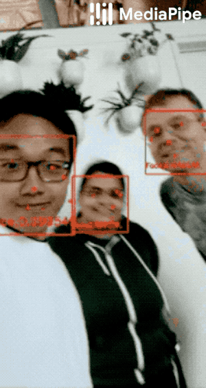

# MediaPipe   

### 1. Face Detection using MediaPipe  :-  <a href="https://github.com/RishavMishraRM/MediaPipe/blob/main/Face_Detection.py">Code</a>

### 2. Face Mesh  :-  <a href="https://github.com/RishavMishraRM/MediaPipe/blob/main/Face_Mesh.py">Code</a>

### 3. Open Pose  :-  <a href="https://github.com/RishavMishraRM/MediaPipe/blob/main/Open_Pose.py">Code</a>

### 4. Hand Detection  :-  <a href="https://github.com/RishavMishraRM/MediaPipe/blob/main/Hand_Detection.py">Code</a>

### 5. Holistic  :-  <a href="https://github.com/RishavMishraRM/MediaPipe/blob/main/Holistic.py">Code</a>

